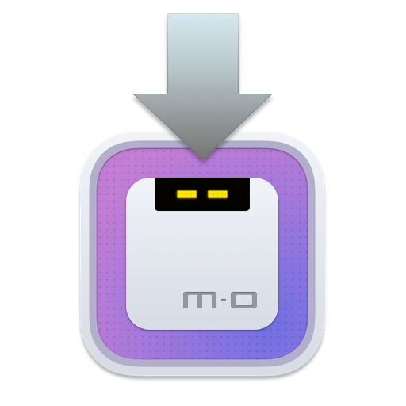

# Motrix 安装助手

<p>
  <a href="https://motrix.app">
    
  </a>
</p>

[English](./README.md) | 简体中文

Motrix v1.8.0+ 版本更改了应用 BundleID, Motrix v1.6.11 的自动更新会因为签名不一致而失败。 本安装助手将帮助您安装最新的 Motrix 应用程序。

Motrix 安装文件会下载到 `Caches` 目录。

```typescript
// https://github.com/electron-userland/electron-builder/blob/54c85374790f7a8e0dc520a20c716b4afe69be20/packages/electron-updater/src/AppAdapter.ts#L32-L44
export function getAppCacheDir() {
  const homedir = getHomedir()
  // https://github.com/electron/electron/issues/1404#issuecomment-194391247
  let result: string
  if (process.platform === "win32") {
    result = process.env["LOCALAPPDATA"] || path.join(homedir, "AppData", "Local")
  } else if (process.platform === "darwin") {
    result = path.join(homedir, "Library", "Caches")
  } else {
    result = process.env["XDG_CACHE_HOME"] || path.join(homedir, ".cache")
  }
  return result
}
```