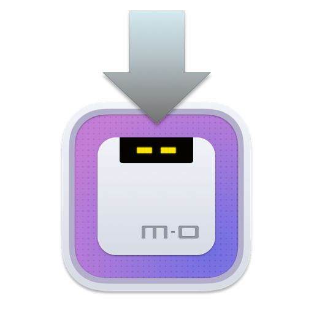

# Motrix Install Assistant

<p>
  <a href="https://motrix.app">
    
  </a>
</p>

English | [简体中文](./README-CN.md)

Since Motrix v1.8.0 and later versions changed the App BundleID, the automatic update of Motrix v1.6.11 will fail. This install assistant will help you install the latest Motrix application.

Motrix will be downloaded on the `Caches` dir.

```typescript
// https://github.com/electron-userland/electron-builder/blob/54c85374790f7a8e0dc520a20c716b4afe69be20/packages/electron-updater/src/AppAdapter.ts#L32-L44
export function getAppCacheDir() {
  const homedir = getHomedir()
  // https://github.com/electron/electron/issues/1404#issuecomment-194391247
  let result: string
  if (process.platform === "win32") {
    result = process.env["LOCALAPPDATA"] || path.join(homedir, "AppData", "Local")
  } else if (process.platform === "darwin") {
    result = path.join(homedir, "Library", "Caches")
  } else {
    result = process.env["XDG_CACHE_HOME"] || path.join(homedir, ".cache")
  }
  return result
}
```